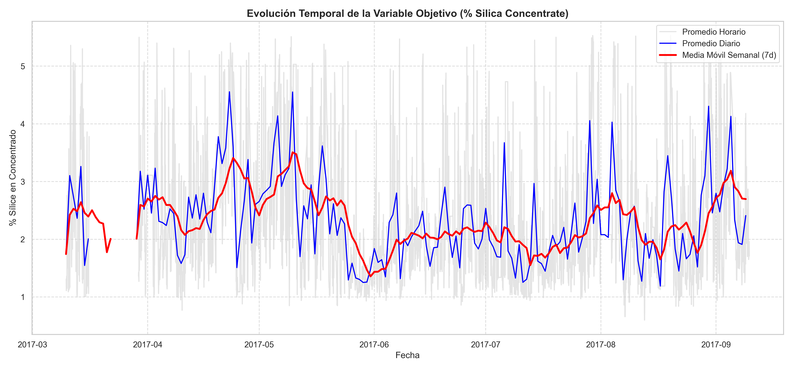
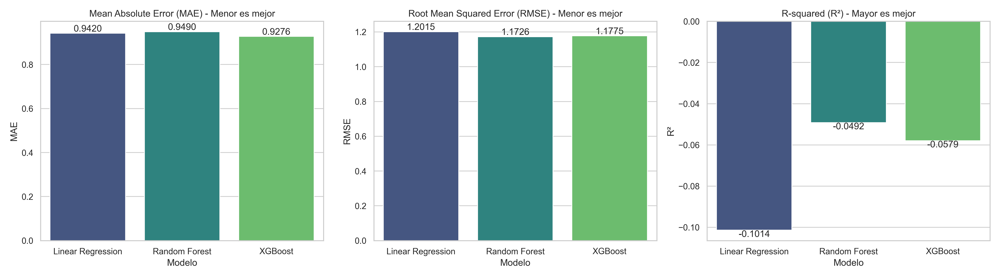
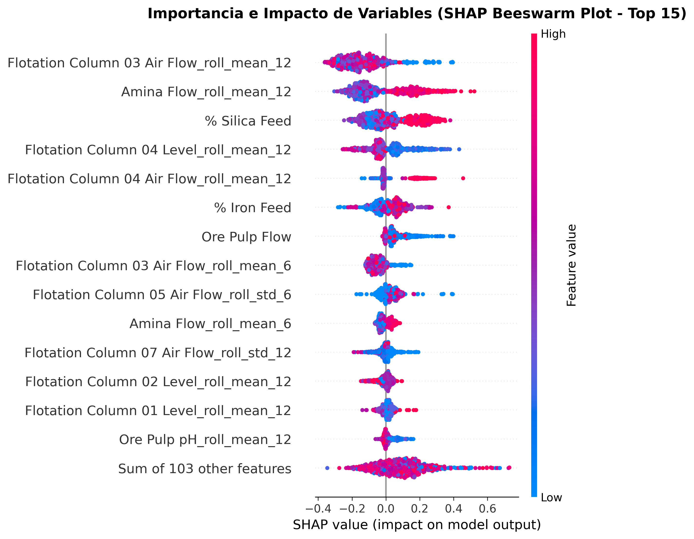
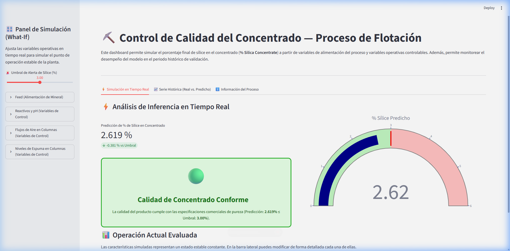
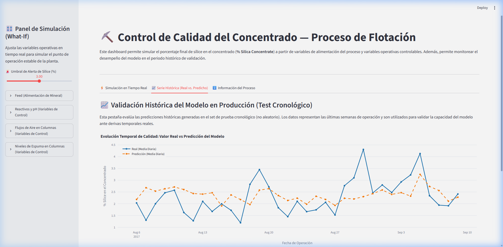
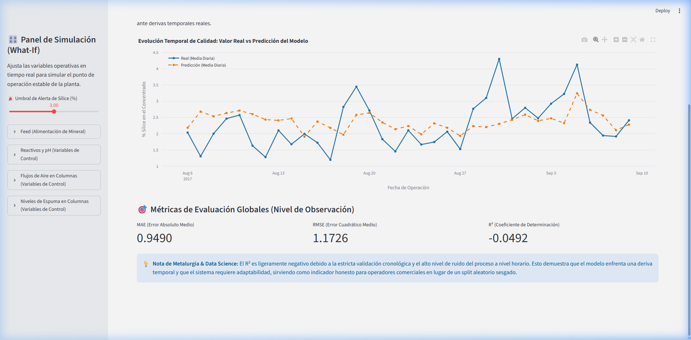

# Predicción de Sílice en Concentrado — Optimización y Control de Flotación Minera

Este repositorio presenta una solución integral de Machine Learning para predecir el porcentaje final de sílice en el concentrado de mineral de hierro (**% Silica Concentrate**), optimizando la operación del proceso de flotación inversa en tiempo real. 

El proyecto incluye la carga y limpieza de datos crudos, ingeniería de variables basada en ventanas móviles, una metodología rigurosa de validación temporal, la comparación de múltiples modelos y un dashboard interactivo en Streamlit con alertas visuales de calidad para la simulación operativa.

---

## 📋 1. Contexto de Negocio

El proceso de **flotación inversa** es una etapa crítica en la purificación de mineral de hierro. El cuarzo (sílice) se considera una impureza perjudicial que reduce de forma drástica la calidad del hierro y la eficiencia de su fundición en los altos hornos (aumentando el consumo de carbón y flux). El objetivo metalúrgico es deprimir y flotar la sílice para retirarla por el rebose de las columnas, logrando un concentrado final con un contenido de sílice bajo (especificación comercial límite usualmente **< 3.00%**).

Para lograr esto, los operadores dosifican reactivos químicos colectores (**Amina**) y depresores (**Almidón**), y ajustan variables físicas de control como el **flujo de aire** y el **nivel de la interfaz de espuma** en las columnas de flotación. 

**Valor de la Solución de Machine Learning:**
En una planta real, los análisis químicos de sílice se reportan con un retraso considerable (mediciones horarias debido al tiempo de análisis en laboratorio o analizador físico). Un modelo predictivo que funcione en tiempo real (segundo a segundo) actúa como un "analizador virtual", alertando tempranamente a los metalurgistas ante desviaciones en la calidad y permitiendo simular puntos de operación óptimos antes de aplicarlos físicamente en las columnas, reduciendo los costos por dosificación excesiva de amina y optimizando la tasa de recuperación de hierro.

---

## 📊 2. Fuente de Datos y Variables

El dataset utilizado corresponde a **[Quality Prediction in a Mining Process](https://www.kaggle.com/datasets/edumagalhaes/quality-prediction-in-a-mining-process)** (Kaggle). Contiene información de 6 meses de operación continua (Marzo a Septiembre de 2017) recolectada con una frecuencia de muestreo de **20 segundos** para variables físicas y de dosificación, y mediciones horarias para las leyes químicas de salida, totalizando **737,453 filas y 24 columnas**.

| Variable | Tipo | Descripción |
|---|---|---|
| `date` | Marca Temporal | Marca de tiempo horaria bajo la cual se agrupan los registros de alta frecuencia. |
| `% Iron Feed` | Perturbación Física | Porcentaje de hierro en la alimentación inicial de mineral. |
| `% Silica Feed` | Perturbación Física | Porcentaje de sílice en la alimentación inicial de mineral. |
| `Starch Flow` | Control Químico | Flujo de almidón (reactivo depresor de hierro) en g/h. |
| `Amina Flow` | Control Químico | Flujo de amina (reactivo colector de sílice) en g/h. |
| `Ore Pulp Flow` | Perturbación Física | Caudal de la pulpa de mineral en m³/h. |
| `Ore Pulp pH` | Control Químico | pH de la pulpa (nivel ideal ~9.5 para selectividad). |
| `Ore Pulp Density` | Perturbación Física | Densidad de la pulpa de mineral en g/cm³. |
| `Flotation Column 01–07 Air Flow` | Control Físico | Flujo de aire inyectado en las columnas de flotación 1 a 7. |
| `Flotation Column 01–07 Level` | Control Físico | Altura del nivel de espuma en las columnas de flotación 1 a 7. |
| `% Iron Concentrate` | **Exclusión (Leakage)** | Porcentaje de hierro final obtenido en el concentrado (salida simultánea). |
| **`% Silica Concentrate`** | **Variable Objetivo (Target)** | Porcentaje final de sílice en el concentrado (salida del proceso). |

---

## 🛠️ 3. Metodología y Pipeline del Proyecto

El desarrollo del proyecto está estructurado de manera modular en cuatro etapas secuenciales:

### 1. Análisis Exploratorio de Datos (EDA) — [01_eda.ipynb](notebooks/01_eda.ipynb)
- **Limpieza de Datos:** Conversión de dtypes y reemplazo de comas decimales (`,`) por puntos (`.`) en todo el dataset.
- **Calidad de Datos:** Confirmación de consistencia y **0% de valores nulos**.
- **Prevención de Target Leakage:** Análisis de la matriz de correlación de Pearson. Se detectó que `% Iron Concentrate` presenta una correlación lineal negativa extrema de **-0.80** con la variable objetivo `% Silica Concentrate`. Al ser una variable medible en la misma marca de tiempo final, su inclusión causaría una fuga de información crítica (haciendo que el modelo sea inútil en la práctica ya que no estaría disponible para inferencia a tiempo real). Por lo tanto, se excluye formalmente del conjunto de entrenamiento.
- **Evolución del Proceso:** Se graficó el comportamiento del concentrado de sílice a lo largo de los 6 meses mediante un remuestreo diario para identificar tendencias macro:
  

### 2. Ingeniería de Variables (Feature Engineering) — [02_feature_engineering.ipynb](notebooks/02_feature_engineering.ipynb)
- **Características Temporales:** Para capturar la dinámica transitoria y la inercia física del proceso en las columnas de flotación, se crearon **promedios móviles** (`mean`) y **desviaciones estándar móviles** (`std`) para ventanas operativas de **3, 6 y 12 observaciones** (equivalentes a ~1, ~2 y ~4 minutos de historial). Estas características se aplicaron sobre las **16 variables de control físico-químicas** (flujo de amina, pH, 7 flujos de aire y 7 niveles de espuma), sumando **96 nuevas características** (totalizando 117 variables explicativas).
- **División Cronológica Rigurosa (Train/Test Split):** A diferencia de un split aleatorio, los datos se dividieron bajo un criterio **estrictamente temporal** (80% inicial para entrenamiento y 20% final para validación) en el punto exacto de la frontera horaria (`2017-08-06 20:00:00`). Un split aleatorio generaría una ilusión de precisión debido a la alta correlación serial de registros tomados cada 20 segundos que comparten una etiqueta horaria idéntica. La división cronológica previene esta fuga de información temporal y simula el escenario de producción real.

### 3. Modelado y Comparación — [03_modelado.ipynb](notebooks/03_modelado.ipynb)
Se entrenaron y compararon tres modelos con aproximaciones matemáticas distintas en el set de prueba cronológico:
- **Línea Base:** Regresión Lineal (con estandarización mediante `StandardScaler`).
- **Bagging de Árboles:** Random Forest Regressor (optimizado con `max_samples=0.1` para entrenamiento rápido en conjuntos grandes).
- **Boosting de Árboles:** XGBoost Regressor (usando `tree_method='hist'`).

---

## 📈 4. Resultados Principales y Comparación de Modelos

Las métricas evaluadas sobre el conjunto de test cronológico (completamente fuera de la muestra de tiempo de entrenamiento) son:

| Modelo | MAE | RMSE | $R^2$ |
| :--- | :---: | :---: | :---: |
| **Linear Regression (Línea Base)** | 0.9420 | 1.2015 | -0.1014 |
| **Random Forest** | 0.9490 | **1.1726** | **-0.0492** |
| **XGBoost** | **0.9276** | 1.1775 | -0.0579 |



### Discusión Técnica sobre el $R^2$ Negativo
Bajo una validación cronológica estricta, los tres modelos registran valores de coeficiente de determinación ($R^2$) ligeramente negativos (el modelo predice levemente peor que la media constante del periodo de evaluación). Esto expone de forma honesta y realista:
1. La presencia de una alta inestabilidad operativa y **deriva temporal (drift)** entre los meses de entrenamiento (Marzo-Agosto) y el mes de validación (Agosto-Septiembre).
2. Que la flotación minera presenta retrasos físicos variables (tiempos de transporte de la pulpa) no modelados de manera puramente estática.
3. Un split aleatorio clásico reportaría un $R^2 > 0.80$ debido al solapamiento de lecturas consecutivas de 20s compartiendo la misma ley química de salida (data leakage), lo cual es irreal en la operación diaria. La validación temporal expone el reto genuino del control adaptativo.

El modelo **Random Forest** se seleccionó y guardó en `models/best_model.joblib` al registrar el mejor comportamiento de error cuadrático general ($R^2$ de **-0.0492** y RMSE de **1.1726**).

---

## 🔍 5. Interpretabilidad Física con SHAP — [04_interpretabilidad_shap.ipynb](notebooks/04_interpretabilidad_shap.ipynb)

Para abrir la "caja negra" del modelo Random Forest ganador, se calculó el impacto y la dirección del efecto de las variables sobre una muestra representativa de prueba utilizando **SHAP (SHapley Additive exPlanations)**.



### Conclusiones Principales:
1. **Validación de la Ingeniería de Variables:** Las dos características de mayor impacto global son promedios de ventanas móviles largas (`Flotation Column 03 Air Flow_roll_mean_12` y `Amina Flow_roll_mean_12`), confirmando que la inercia acumulada de las últimas observaciones temporales tiene mayor poder predictivo que las lecturas instantáneas fluctuantes.
2. **Colector Químico (Amina):** Concentraciones altas de `Amina Flow_roll_mean_12` (puntos rojos a la izquierda) muestran una fuerte contribución a la disminución del porcentaje de sílice en el concentrado, validando su función físico-química como agente colector que extrae impurezas.
3. **Calidad de Entrada:** Valores altos de porcentaje inicial de sílice (`% Silica Feed`) empujan de manera directa las predicciones de sílice final al alza, actuando como la principal perturbación física del mineral de alimentación.

---

## 💻 6. Dashboard Interactiva de Control (Streamlit)

Se desarrolló un tablero web interactivo en `dashboard/app.py` que sirve como consola de monitoreo y simulación para el operador de planta.

### Características Clave:
* **Simulación en Tiempo Real (Análisis What-If):** Permite cambiar las 21 variables manipulables de planta (reactivos, aire, niveles, leyes de alimentación) y predecir al instante el contenido de sílice resultante bajo un estado estacionario simulado.
* **Semáforo de Calidad Visual:** Alerta de forma interactiva (Verde/Rojo) si la concentración predicha supera el umbral máximo de tolerancia comercial configurado.
* **Validación Histórica Interactiva:** Gráfico dinámico en Plotly que compara la serie de tiempo real del set de test con la predicción del modelo agregada por día.

### Capturas del Tablero:

#### 1. Inferencia Operativa y Semáforo de Calidad (Cumple Norma)


#### 2. Serie Histórica Interactiva (Plotly)


#### 3. Tarjetas de Desempeño y Métricas de Validación


---

## 🚀 7. Guía de Ejecución Local

### Prerrequisitos
Se requiere Python 3.10 o superior. Instalar las dependencias listadas en `requirements.txt`:
```bash
pip install -r requirements.txt
```

### Descarga del Dataset
Descarga el archivo `MiningProcess_Flotation_Plant_Database.csv` directamente desde [Kaggle](https://www.kaggle.com/datasets/edumagalhaes/quality-prediction-in-a-mining-process) y colócalo en el directorio del proyecto en la ruta:
`data/raw/`

### Ejecución de los Notebooks
Para recrear de forma automatizada las etapas del pipeline de datos y modelado, ejecuta los notebooks en la carpeta `notebooks/` en orden correlativo:
1. `01_eda.ipynb` (Limpieza inicial y gráficos temporales).
2. `02_feature_engineering.ipynb` (Creación de ventanas móviles y división cronológica).
3. `03_modelado.ipynb` (Entrenamiento de modelos y serialización en `models/`).
4. `04_interpretabilidad_shap.ipynb` (Cálculo y guardado del beeswarm plot).

### Levantar la Aplicación de Streamlit
Para ejecutar de forma local el dashboard interactivo de monitoreo y simulación, corre el siguiente comando en tu terminal:
```bash
streamlit run dashboard/app.py
```
La aplicación abrirá automáticamente una pestaña en tu navegador en la dirección local **`http://localhost:8501`**.
